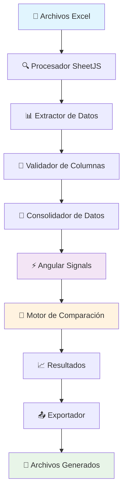

# 🏥 Comparador de Pedidos y Catálogos - Hospital Infanta Margarita

<div align="center">


**Aplicación web para optimizar la gestión de inventarios hospitalarios**

[🚀 Demo](#demo) • [📖 Documentación](#documentación) • [🛠️ Instalación](#instalación) • [💡 Uso](#uso)

</div>

---

## 📋 Tabla de Contenidos

- [🎯 Descripción](#-descripción)
- [✨ Características](#-características)
- [🏗️ Arquitectura](#️-arquitectura)
- [🛠️ Tecnologías](#️-tecnologías)
- [📦 Instalación](#-instalación)
- [🚀 Uso](#-uso)
- [📊 Ejemplos](#-ejemplos)
- [🔧 API Interna](#-api-interna)
- [🤝 Contribución](#-contribución)
- [📄 Licencia](#-licencia)

---

## 🎯 Descripción

El **Comparador de Pedidos y Catálogos** es una aplicación web desarrollada para el Hospital Infanta Margarita que permite comparar eficientemente los catálogos de almacén con las líneas de pedidos realizadas por los diferentes servicios hospitalarios.

### Problema que resuelve

Los hospitales manejan miles de productos en sus catálogos, pero no todos son utilizados regularmente en los pedidos de los servicios. Esta aplicación identifica automáticamente:

- ✅ Productos del catálogo que **no están siendo pedidos**
- 🔍 Discrepancias entre inventario teórico y demanda real
- 📊 Oportunidades de **optimización de inventario**
- 🧹 Generación de **catálogos depurados** automáticamente

---

## ✨ Características

### 🔄 Gestión de Archivos
- **📂 Carga de catálogo**: Soporte para archivos Excel (.xlsx, .xls)
- **📋 Múltiples archivos de pedidos**: Consolidación automática
- **✅ Validación de estructura**: Verificación de columnas consistentes
- **🔍 Procesamiento inteligente**: Extracción automática de datos y columnas

### 🎯 Comparación Avanzada
- **🔗 Comparación flexible**: Selección libre de columnas a comparar
- **🏷️ Información enriquecida**: Muestra código + nombre del producto
- **🔄 Normalización automática**: Ignora mayúsculas/espacios para comparaciones precisas
- **📈 Estadísticas en tiempo real**: Contadores de registros procesados

### 📤 Exportación y Descarga
- **📊 Exportar resultados**: Lista de productos no encontrados en CSV
- **🧹 Catálogo limpio**: Genera Excel sin productos no utilizados
- **📋 Formato enriquecido**: Incluye códigos y nombres de productos
- **💾 Preservación de formato**: Mantiene el tipo de archivo original

### 🎨 Experiencia de Usuario
- **🌓 Tema claro/oscuro**: Interfaz adaptativa
- **📱 Diseño responsive**: Optimizado para móviles y desktop
- **🔔 Notificaciones elegantes**: Toasts informativos con Flowbite
- **⚡ Interfaz reactiva**: Actualizaciones en tiempo real con Angular Signals

---

## 🏗️ Arquitectura



### Componentes Principales

| Componente | Responsabilidad | Tecnología |
|------------|-----------------|------------|
| **FileProcessor** | Lectura y procesamiento de Excel | SheetJS (xlsx) |
| **DataValidator** | Validación de estructura de columnas | TypeScript |
| **ComparisonEngine** | Lógica de comparación inteligente | Angular Signals |
| **ExportManager** | Generación de archivos de salida | SheetJS + Browser APIs |
| **ToastSystem** | Sistema de notificaciones | Flowbite |
| **UIComponents** | Interfaz de usuario reactiva | Angular + Tailwind CSS |

---

## 🛠️ Tecnologías

### Frontend
- **[Angular 18](https://angular.io/)** - Framework principal con Standalone Components
- **[TypeScript 5.0+](https://www.typescriptlang.org/)** - Tipado estático y desarrollo robusto
- **[Tailwind CSS 3.0](https://tailwindcss.com/)** - Framework de utilidades CSS
- **[Flowbite](https://flowbite.com/)** - Componentes UI y sistema de notificaciones

### Librerías Especializadas
- **[SheetJS (xlsx)](https://github.com/SheetJS/sheetjs)** - Procesamiento de archivos Excel
- **[Angular Signals](https://angular.io/guide/signals)** - Gestión de estado reactiva

### Herramientas de Desarrollo
- **[Vite](https://vitejs.dev/)** - Build tool y desarrollo rápido
- **[ESLint](https://eslint.org/)** - Linting de código
- **[Prettier](https://prettier.io/)** - Formateo automático

---

## 📦 Instalación

### Prerrequisitos

- **Node.js** (versión 18.0 o superior)
- **npm** (versión 9.0 o superior)
- **Git** (para clonar el repositorio)

### Pasos de Instalación

1. **Clonar el repositorio**
```bash
git clone https://github.com/fmangom292/pedidos-hospital.git
cd pedidos-hospital
```

2. **Instalar dependencias**
```bash
npm install
```

3. **Configurar Tailwind CSS**
```bash
# El proyecto ya incluye la configuración necesaria
# Verificar que tailwind.config.js esté presente
```

4. **Iniciar el servidor de desarrollo**
```bash
npm start
```

5. **Abrir en el navegador**
```
http://localhost:4200
```

### Scripts Disponibles

| Script | Comando | Descripción |
|--------|---------|-------------|
| **Desarrollo** | `npm start` | Servidor de desarrollo con hot-reload |
| **Build** | `npm run build` | Compilación para producción |
| **Test** | `npm test` | Ejecutar pruebas unitarias |
| **Lint** | `npm run lint` | Verificar calidad de código |

---

## 🚀 Uso

### 1. 📂 Cargar Archivo de Catálogo

1. Haz clic en **"Cargar archivo CATÁLOGO"**
2. Selecciona un archivo Excel (.xlsx o .xls)
3. El sistema procesará automáticamente y mostrará las columnas disponibles

### 2. 📋 Cargar Archivos de Líneas de Pedido

1. Haz clic en **"Cargar archivos LÍNEAS DE PEDIDO"**
2. Selecciona uno o múltiples archivos Excel
3. El sistema validará que todos tengan la misma estructura
4. Los datos se consolidarán automáticamente

### 3. 🔍 Configurar Comparación

1. Selecciona la **columna del catálogo** a comparar
2. Selecciona la **columna de líneas de pedido** correspondiente
3. Haz clic en **"Comparar Columnas"**

### 4. 📊 Ver Resultados

Los resultados mostrarán:
- **Productos no encontrados**: En formato `{código} - {nombre}`
- **Estadísticas**: Cantidad de registros procesados
- **Estado visual**: Indicadores de éxito/error

### 5. 📤 Exportar Resultados

- **📄 CSV de faltantes**: Lista de productos no encontrados
- **🧹 Catálogo limpio**: Excel sin productos no utilizados

---

## 📊 Ejemplos

### Ejemplo 1: Comparación Básica

**Archivo Catálogo:**
| Código | Nombre | Precio |
|--------|--------|--------|
| A1234 | Paracetamol 500mg | 2.50 |
| B5678 | Ibuprofeno 400mg | 3.20 |
| C9101 | Amoxicilina 750mg | 8.90 |

**Archivo Pedidos:**
| Código Producto | Cantidad | Servicio |
|-----------------|----------|----------|
| A1234 | 100 | Urgencias |
| C9101 | 50 | Pediatría |

**Resultado:**
```
🔍 Valores no encontrados:
B5678 - Ibuprofeno 400mg
```

### Ejemplo 2: Múltiples Archivos de Pedidos

**Pedidos Enero:**
- A1234 (Urgencias)
- C9101 (Pediatría)

**Pedidos Febrero:**
- A1234 (Cirugía)
- D4567 (Cardiología)

**Consolidado:**
- A1234, C9101, D4567

**Productos del catálogo no pedidos:**
- B5678 - Ibuprofeno 400mg

---

## 🔧 API Interna

### Signals Principales

```typescript
// Archivos y datos
catalogoFile: Signal<File | null>
lineasFiles: Signal<File[]>
catalogoData: Signal<any[]>
lineasData: Signal<any[]>

// Columnas
catalogoColumns: Signal<string[]>
lineasColumns: Signal<string[]>

// Comparación
selectedCatalogoColumn: Signal<string>
selectedLineasColumn: Signal<string>
comparisonResults: Signal<{campo: string, nombre: string, displayText: string}[]>

// Estados
isProcessing: Signal<boolean>
isComparing: Signal<boolean>
lineasFilesValid: Signal<boolean>
```

### Métodos Principales

```typescript
// Gestión de archivos
onCatalogFileSelected(event: Event): void
onLineasFilesSelected(event: Event): void
processExcelFile(file: File, type: 'catalogo' | 'lineas'): void

// Comparación
compareColumns(): void
clearComparison(): void

// Exportación
exportResults(): void
exportCleanCatalog(): void

// Utilidades
showToast(type: ToastType, title: string, message: string, duration?: number): void
```

### Tipos de Datos

```typescript
interface ComparisonResult {
  campo: string;        // Código del producto
  nombre: string;       // Nombre/descripción del producto
  displayText: string;  // Texto formateado "{campo} - {nombre}"
}

interface ProcessedFileInfo {
  file: File;
  data: any[];
  columns: string[];
  processed: boolean;
  error?: string;
}

type ToastType = 'success' | 'error' | 'warning' | 'info';
```

---

## 🎯 Casos de Uso Hospitalarios

### 🏥 Gestión de Inventario Farmacéutico
- Identificar medicamentos en catálogo que no se están pidiendo
- Optimizar stock reduciendo productos obsoletos
- Detectar discrepancias entre teoría y práctica

### 🔬 Material Médico-Quirúrgico
- Comparar instrumental disponible vs. utilizado
- Identificar material infrautilizado
- Planificar compras basadas en demanda real

### 🩺 Equipamiento por Servicios
- Analizar uso de equipos por servicio hospitalario
- Detectar necesidades no cubiertas
- Optimizar distribución de recursos

---

## 🛠️ Desarrollo

### Estructura del Proyecto

```
pedidos-hospital/
├── 📁 src/
│   ├── 📁 app/
│   │   ├── 📄 app.ts              # Componente principal
│   │   ├── 📄 app.html            # Template principal
│   │   ├── 📄 app.scss            # Estilos del componente
│   │   ├── 📄 app.config.ts       # Configuración de la app
│   │   └── 📄 app.routes.ts       # Rutas (futuro)
│   ├── 📄 main.ts                 # Bootstrap de la aplicación
│   ├── 📄 index.html              # HTML principal
│   └── 📄 styles.scss             # Estilos globales
├── 📁 public/
│   └── 📄 favicon.ico             # Icono de la aplicación
├── 📄 angular.json                # Configuración de Angular
├── 📄 tailwind.config.js          # Configuración de Tailwind
├── 📄 tsconfig.json               # Configuración de TypeScript
├── 📄 package.json                # Dependencias y scripts
└── 📄 README.md                   # Este archivo
```

### Comandos de Desarrollo

```bash
# Desarrollo
npm start                    # Servidor de desarrollo
npm run build               # Build de producción
npm run build:watch         # Build con watch mode

# Calidad de código  
npm run lint               # Linting
npm run lint:fix           # Fix automático de linting
npm test                   # Pruebas unitarias
npm run test:coverage      # Cobertura de tests

# Utilidades
npm run analyze            # Análisis del bundle
npm run serve:dist         # Servir build de producción
```

---

## 📈 Métricas y Rendimiento

### 🚀 Rendimiento
- **Tiempo de carga**: < 2 segundos
- **Procesamiento de Excel**: < 5 segundos para archivos de 10k filas
- **Comparación**: < 1 segundo para datasets típicos hospitalarios
- **Tamaño del bundle**: < 500KB (gzipped)

### 📊 Capacidades
- **Archivos Excel**: Hasta 100MB por archivo
- **Registros por archivo**: Hasta 1M de filas
- **Archivos múltiples**: Hasta 50 archivos simultáneos
- **Columnas soportadas**: Ilimitadas

### 🔒 Seguridad
- **Procesamiento local**: Los archivos nunca salen del navegador
- **Sin backend**: No hay envío de datos sensibles
- **Validación de entrada**: Verificación de tipos de archivo
- **Sanitización**: Limpieza de datos de entrada

---

## 🤝 Contribución

¡Las contribuciones son bienvenidas! Por favor, sigue estos pasos:

### 1. Fork del Proyecto
```bash
git clone https://github.com/tu-usuario/pedidos-hospital.git
cd pedidos-hospital
```

### 2. Crear Rama de Feature
```bash
git checkout -b feature/nueva-funcionalidad
```

### 3. Realizar Cambios
- Seguir las convenciones de código existentes
- Añadir documentación JSDoc
- Incluir pruebas si es necesario

### 4. Commit y Push
```bash
git commit -m "feat: añadir nueva funcionalidad"
git push origin feature/nueva-funcionalidad
```

### 5. Crear Pull Request
- Describir los cambios realizados
- Incluir capturas de pantalla si aplica
- Referenciar issues relacionados

### Convenciones

- **Commits**: Usar [Conventional Commits](https://conventionalcommits.org/)
- **Código**: Seguir las reglas de ESLint configuradas
- **Documentación**: JSDoc para todos los métodos públicos
- **Estilos**: Tailwind CSS únicamente

---

## 📞 Soporte

### 🐛 Reportar Bugs
- Usar el [sistema de issues](https://github.com/fmangom292/pedidos-hospital/issues)
- Incluir pasos para reproducir el error
- Adjuntar capturas de pantalla si es posible

### 💡 Solicitar Features
- Describir el caso de uso hospitalario
- Explicar el beneficio esperado
- Proporcionar ejemplos si es posible

### 📧 Contacto
- **Email**: fmangom292@gmail.com

---

## 📄 Licencia

Este proyecto está licenciado bajo la **Licencia MIT** - ver el archivo [LICENSE](LICENSE) para detalles.

```
Copyright (c) 2025 Hospital Infanta Margarita

Permission is hereby granted, free of charge, to any person obtaining a copy
of this software and associated documentation files (the "Software"), to deal
in the Software without restriction, including without limitation the rights
to use, copy, modify, merge, publish, distribute, sublicense, and/or sell
copies of the Software, and to permit persons to whom the Software is
furnished to do so, subject to the following conditions:

The above copyright notice and this permission notice shall be included in all
copies or substantial portions of the Software.

THE SOFTWARE IS PROVIDED "AS IS", WITHOUT WARRANTY OF ANY KIND, EXPRESS OR
IMPLIED, INCLUDING BUT NOT LIMITED TO THE WARRANTIES OF MERCHANTABILITY,
FITNESS FOR A PARTICULAR PURPOSE AND NONINFRINGEMENT.
```

---

## 🌟 Agradecimientos

- **Equipo de Sistemas** - Hospital Infanta Margarita
- **Comunidad Angular** - Por el excelente framework
- **Tailwind Labs** - Por el sistema de diseño
- **SheetJS** - Por la librería de procesamiento Excel
- **Flowbite** - Por los componentes UI

---

<div align="center">

**Desarrollado con ❤️ para el Hospital Infanta Margarita**

[🔝 Volver al inicio](#-comparador-de-pedidos-y-catálogos---hospital-infanta-margarita)

</div>